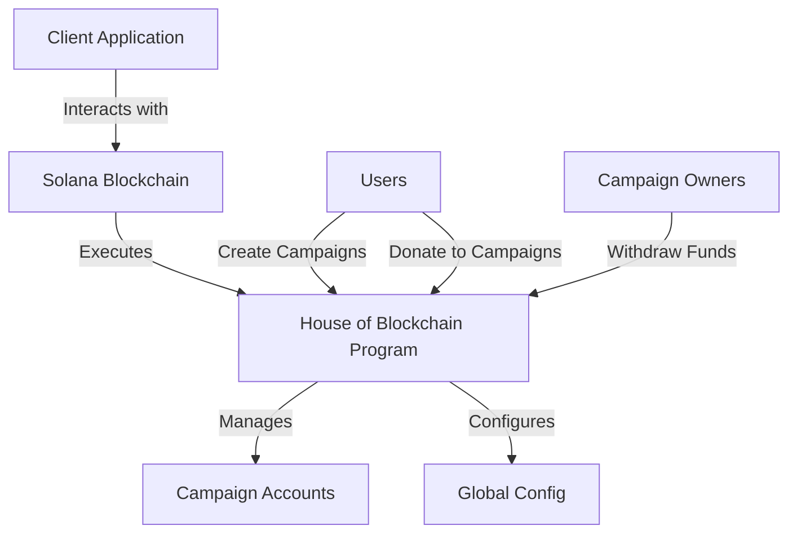
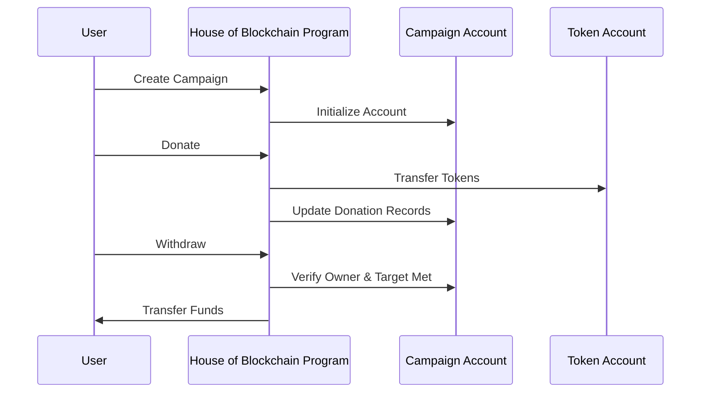

# House of Blockchain

A decentralized crowdfunding platform built on the Solana blockchain using the Anchor framework. This project allows users to create campaigns, donate to them, and campaign owners to withdraw funds once the target is reached.

## Table of Contents

- [Architecture](#architecture)
- [Project Structure](#project-structure)
- [Setup Instructions](#setup-instructions)
- [Program Instructions](#program-instructions)
- [Testing](#testing)

## Architecture

House of Blockchain operates on the Solana blockchain with the following key components:



### Data Flow



## Project Structure

```
├── programs/                   # Contains Solana programs
│   └── heartofblockchain/      # Main program
│       ├── src/
│       │   ├── instructions/   # Program instructions
│       │   ├── state/          # Account structures
│       │   ├── error.rs        # Custom error definitions
│       │   └── lib.rs          # Program entry point
├── tests/                      # Integration tests
├── Anchor.toml                 # Anchor configuration
├── Cargo.toml                  # Rust dependencies
├── package.json                # JavaScript dependencies
└── tsconfig.json               # TypeScript configuration
```

## Setup Instructions

### Prerequisites

- [Rust](https://www.rust-lang.org/tools/install)
- [Solana CLI](https://docs.solana.com/cli/install-solana-cli-tools)
- [Anchor](https://www.anchor-lang.com/docs/installation)
- [Node.js](https://nodejs.org/) (v14 or later)
- [Yarn](https://yarnpkg.com/getting-started/install)

### Installation

1. Clone the repository:
   ```bash
   git clone https://github.com/calc1f4r/heartofblockchain
   cd heartofblockchain
   ```

2. Install dependencies:
   ```bash
   yarn install
   ```

3. Build the program:
   ```bash
   anchor build
   ```

4. Update the program ID:
   - Copy the new program ID from the build output
   - Update the ID in `programs/heartofblockchain/src/lib.rs` and `Anchor.toml`

5. Deploy to localnet:
   ```bash
   anchor deploy
   ```

6. Run tests:
   ```bash
   anchor test
   ```

## Program Instructions

The program supports the following instructions:

### Initialize Global Config
Sets up the global configuration for the program with an admin address.

### Update Global Admin
Allows the current admin to transfer admin rights to a new address.

### Create Campaign
Creates a new crowdfunding campaign with a name, description, and target amount.

### Donate
Allows users to donate to a specific campaign.

### Withdraw
Enables campaign owners to withdraw the accumulated funds after the campaign target is reached.

## State Accounts

### Global Config
Stores global program settings and the admin public key.

### Campaign
Stores information about a crowdfunding campaign including:
- Owner
- Name
- Description
- Target amount
- Current amount
- Withdrawn status

## Testing

Run the test suite with:

```bash
anchor test
```

For coverage reports:

```bash
anchor test -- --coverage
```

